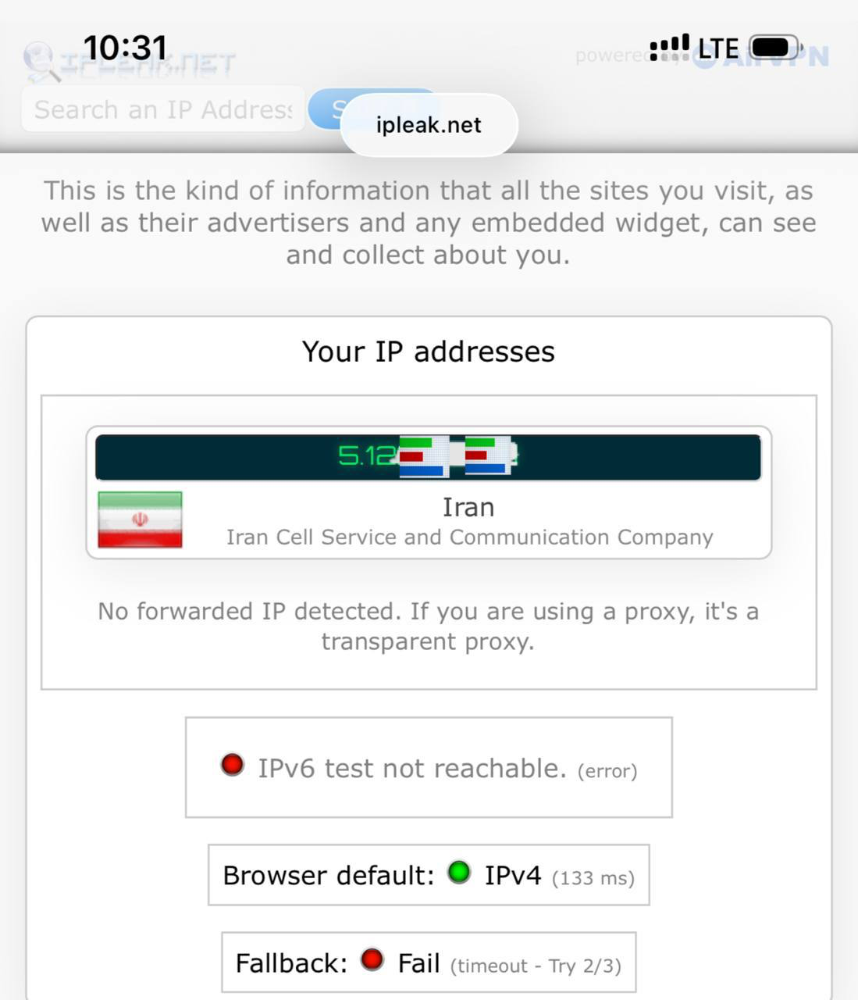
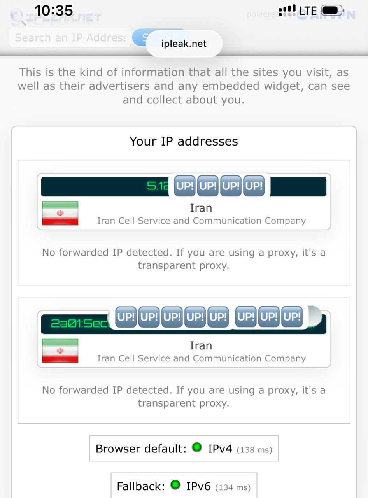
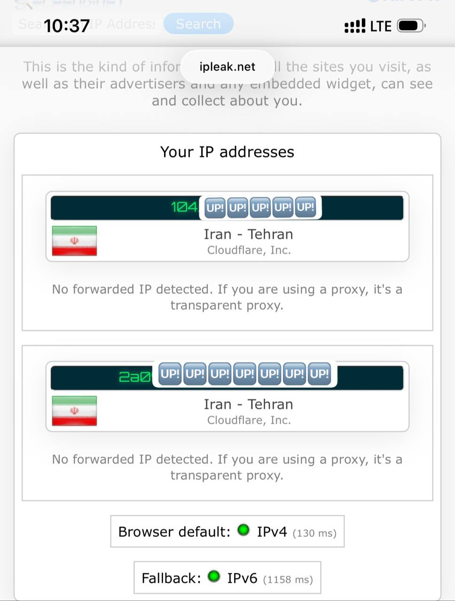

 # 📱 iOS APN Profile Generator | سازنده پروفایل APN برای آیفون

[English](#english) | [فارسی](#فارسی)

---

## فارسی

یک ابزار تحت وب ساده، سریع، امن و سمت کلاینت (Client-Side) برای تولید پروفایل‌های پیکربندی اینترنت همراه (`.mobileconfig`) در دستگاه‌های آیفون و آیپد (iOS / iPadOS).

این ابزار برای حل مشکلات تنظیمات اینترنت، فعال‌سازی دیتا و ساخت خودکار پروفایل APN اپراتورهای مختلف بدون نیاز به ارسال اطلاعات به سرور استفاده می‌شود.

### ✨ ویژگی‌ها

* **کاملاً سمت کاربر (Client-Side):** هیچ داده‌ای به هیچ سروری ارسال نمی‌شود؛ تمام فایل در مرورگر خود شما تولید می‌شود.
* **سازگار با Cloudflare Pages و GitHub Pages:** بدون نیاز به فریم‌ورک یا بیلد، فقط با یک فایل HTML ساده.
* **تولید MIME Type استاندارد اپل:** ایجاد نوع داده `application/x-apple-aspen-config` جهت باز شدن مستقیم پنجره نصب در مرورگر Safari.
* **پشتیبانی از انواع پی‌لود:** پشتیبانی از حالت مدرن Cellular (iOS 7+) و حالت قدیمی APN.
* **تنظیمات احراز هویت و پروکسی:** پشتیبانی از CHAP / PAP و پروکسی.

### 📲 نحوه نصب پروفایل در آیفون

1. با مرورگر **Safari** وارد آدرس سایت خود شوید.
2. نام APN اپراتور خود را وارد کرده و دکمه **دانلود و ساخت پروفایل** را بزنید.
3. در پیام باز شده، گزینه **Allow** را بزنید تا پروفایل دانلود شود.
4. وارد تنظیمات گوشی (**Settings**) شوید.
5. در بالای صفحه گزینه **Profile Downloaded** را انتخاب کرده و روی **Install** بزنید.
   
> ### 🌐 [ورود به ابزار آنلاین iOS APN Profile Generator](https://soroushse7o.github.io/iOS-APN-Profile-Generator/)
> برای ساخت آسان و مستقیم پروفایل‌های تنظیمات APN در iOS روی لینک بالا کلیک کنید.

## 📊 مراحل تست و نتایج اتصال | Test & Results

در این سناریو، نحوه فعال‌سازی پروتکل پشته دوگانه (Dual-Stack) و تأثیر آن بر اتصال سرویس‌های مبتنی بر IPv6/WARP بررسی شده است:

| ۱. پیش‌فرض سیستم‌عامل | ۲. اعمال پروفایل سفارشی | ۳. اتصال Cloudflare WARP |
| :---: | :---: | :---: |
| **غیرفعال بودن IPv6** | **فعال‌سازی Dual-Stack** | **برقراری ارتباط از بستر IPv6** |
|  |  |  |
| تست خطا در ارتباط IPv6 | اختصاص آدرس Public IPv6 اپراتور | عبور ترافیک و اتصال پایدار بر بستر IPv6 |

---

### توضیحات فنی مراحل:

* **تصویر اول (Default Settings):** به دلیل محدودیت تنظیمات پیش‌فرض APN در iOS، آدرس IPv6 فعال نبوده و تست با خطای `IPv6 test not reachable` مواجه می‌شود.
* **تصویر دوم (Profile Applied):** با اعمال مقدار `AllowedProtocolMask = 3` از طریق پروفایل، پشته شبکه به حالت `IPv4/IPv6` تغییر یافته و آدرس IPv6 معتبر اپراتور دریافت می‌گردد.
* **تصویر سوم (WARP Established):** پس از برقراری بستر IPv6، تونل Cloudflare WARP بدون اختلال متصل شده و ترافیک شبکه به مقاصد انی‌کست کلودفلر هدایت می‌شود.

---

## English

A lightweight, secure, fully client-side web utility to generate Apple iOS/iPadOS mobile configuration profiles (`.mobileconfig`) for custom APN (Access Point Name) cellular settings.

### ✨ Features

* **100% Client-Side:** No server-side storage or tracking. The profile is generated purely inside your browser using JavaScript.
* **Direct Safari Installation:** Uses `application/x-apple-aspen-config` MIME type for seamless prompt & installation inside Safari on iOS.
* **Zero-Config Hosting:** Fully compatible with static hosts like GitHub Pages and Cloudflare Pages.
* **Modern & Legacy Payload Support:** Supports modern `com.apple.cellular` (iOS 7+) as well as legacy `com.apple.apn.managed`.
* **Customizable:** Configure APN name, username, password, authentication type (CHAP/PAP), proxy, and IP protocols (IPv4 / IPv6).

### 📲 How to Install Profile on iOS

1. Open the hosted webpage using **Safari** on your iPhone/iPad.
2. Fill in the APN details and tap **دانلود و ساخت پروفایل / Generate Profile**.
3. Tap **Allow** when prompted to download the configuration profile.
4. Open the **Settings** app on iOS.
5. Tap **Profile Downloaded** near the top of the settings page and select **Install**.

---

### 📄 License

MIT License. Free to use, modify, and distribute.